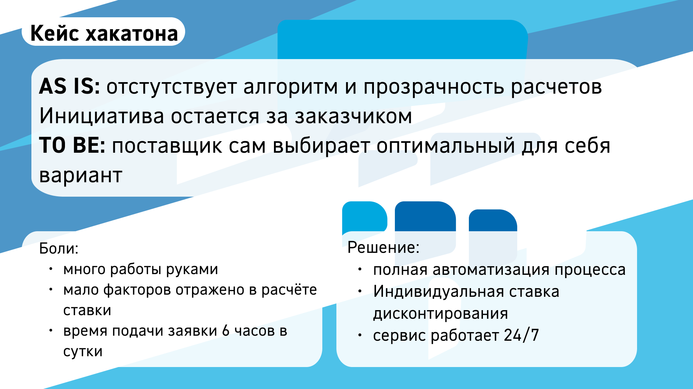
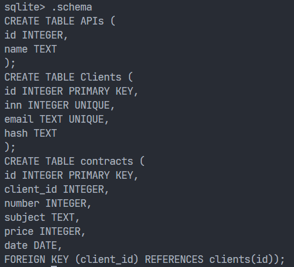
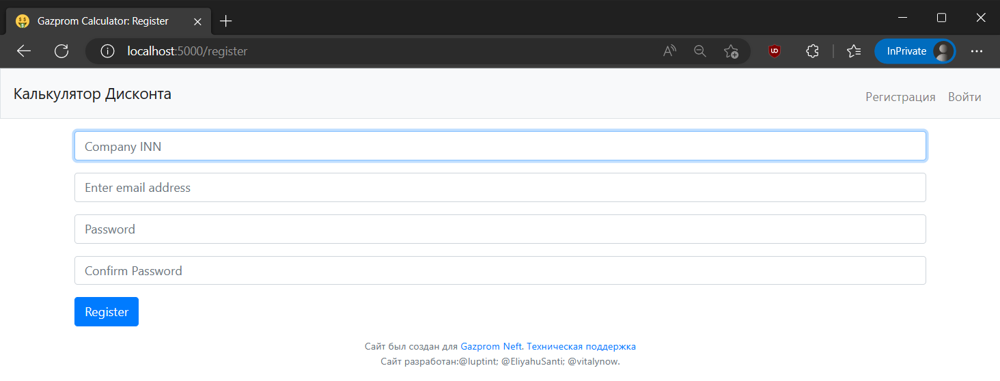
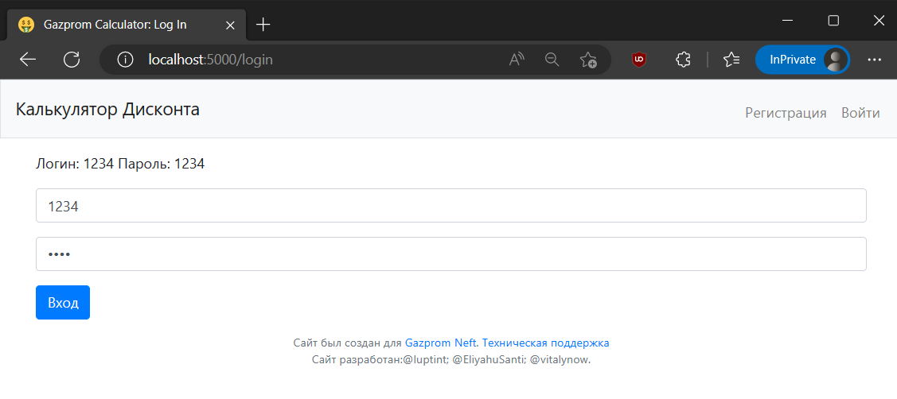
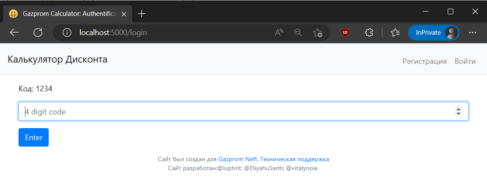
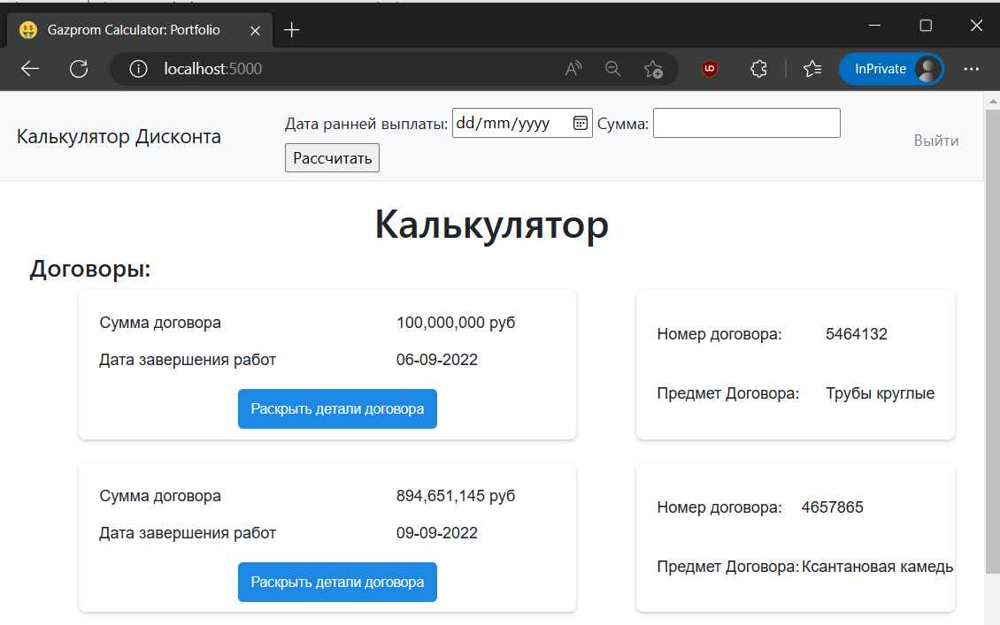
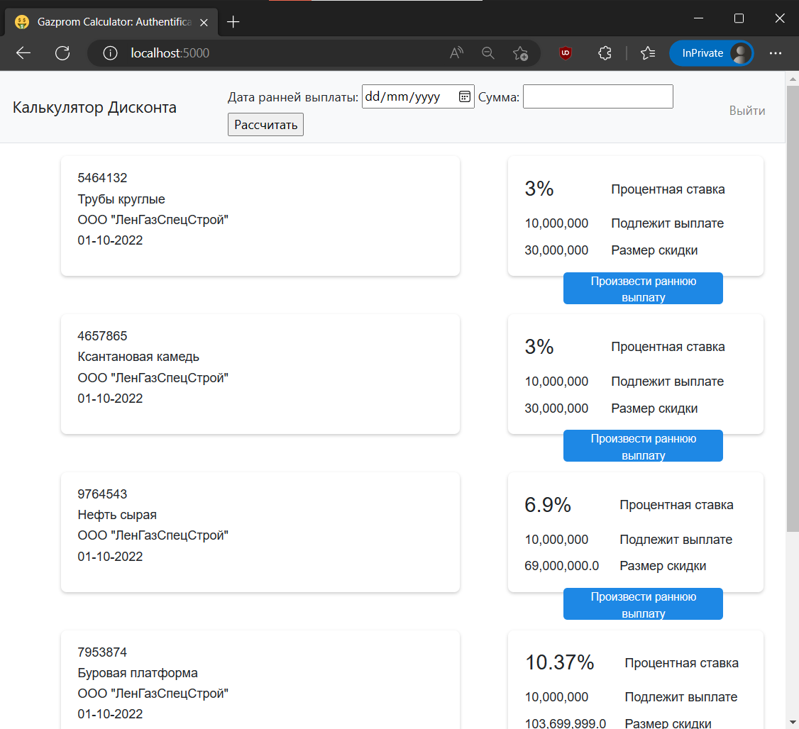

# Dynamic discount calculator
Calculator of the discount rate of early payments for legal entities.  
Written on Python Flask using flask_ngrok library to self-host and SQLite database.  
  

Database schema  
  
---
Registration form  
  
---
Login form  
  
---
Two Factor Authentication  
  
---
Main page  
  
---
Calculation result  
  
---
